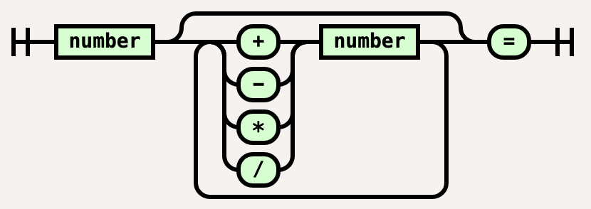
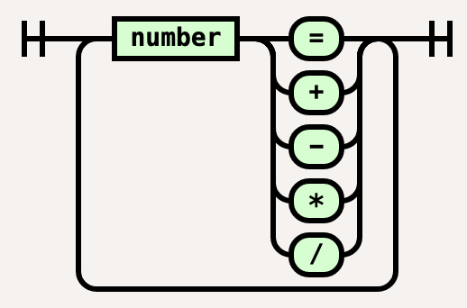

# ACCU Code Critique 136

## Symptoms and Observations

### `div` Error Message

This problem stems from the use of an unscoped enum that introduces the enumerators' names in the surrounding scope. 
Because `div` is the name of a standard library function defined in header `<cstdlib>`, introducing div into the global 
scope via the enumerator causes error messages by the compiler due to name hiding.

The use of the function name `apply` could also be seen as dangerous, but `std::apply` is a C++ library function 
(that I contributed based on Jonathen Wakely's example), 
not also in the global namespace as happens with the functions from the C standard library, 
that are introduced both in the namespace `std` as well as into the global namespace.

For an enumeration where the use of the enumerators is quite limited, it might be better to use either a scoped enumeration (`enum class`), 
or to define the enumeration in a non-global scope.

## General Observation

The code is definitely C++, but uses some C-ish style:

* epression.h: using `typedef` to introduce a type alias for an otherwise unnamed enumeration is a practice useful in C, 
  but in C++ the name of an enumeration becomes a first class type, so there is no need to use a type alias. 
  In C it is common practice to use typedef aliases for struct and enum types to avoid having to reuse the corresponding keyword
  for each use of the type.
  If type aliases are needed in C++, they should be declared with `using` alias instead of `typedef`, 
  if only for the improved readability of the declaration.

* calculate.cpp: uses a C-style cast operator to convert the operation character to the enumeration.
  While C-style casts look convenient, they suffer from the ability to perform any of the C++-style casts.
  Here a `static_cast` would be more appropriate. In addition, none of the local variables is initialized. 
  This is not a real problem in the current code, but can lead to problems after refactoring.

The obvious bug are the missing case label specification and after being corrected the break statements (or returns) in expression.cpp for each case and 
also the non-error-handling in the `default:` case, that silently falls through. Since the author seems to know that `break;` exists from calculate.cpp, 
the author seems to be ignorant of the correct syntax of switch-case. Turning on warnings, my compiler shows
 ../expression.cpp:6:3: warning: label 'add' defined but not used [-Wunused-label]
     6 |   add:
       |   ^~~

for `add:`, `sub:`, `mult:`, and `div:` each. This is because the names are used to define `goto`-targets but not switch-case labels.
A further observation, that shows something is shady, is that the function `apply()` uses the label `mult:`, 
whereas the enumeration uses the enumerator `mul`.


# Quick fixes for the obvious

Let's start writing a few test cases:

```{.cpp}
void Adding1plus1Istwo(){
    ASSERT_EQUAL(2., apply(1.,hack::add,1.));
}
void Subtracting4From6Is2(){
    ASSERT_EQUAL(2., apply(6.,hack::sub,4.));
}
void Multiply2By3Is6(){
    ASSERT_EQUAL(6., apply(2.,hack::mul,3.));
}
void Divide6By3Is2(){
    ASSERT_EQUAL(2., apply(6.,hack::div,3.));
}
```

Note, that in general it is dangerous to use equality comparison for floating point numbers. 
However, the unit testing framework CUTE (https://cute-test.com), detects this situation with 
its `ASSERT_EQUAL()` macro and does a close match of the expected and actual value instead.

With adding `case` and `break;` appropriately, we get the following:

```{.cpp}
double apply(double lhs, operation oper,
             double rhs) {
  switch (oper) {
  case add:
    lhs += rhs; break;
  case sub:
    lhs -= rhs; break;
  case mul:
    lhs *= rhs; break;
  case div:
    lhs /= rhs; break;
  default:
  }
  return lhs;
}
```

This solves the worst problems, but still has a lot of lacking. 

For example, the `main()` function contains significant (convoluted) logic that is untestable, because we
cannot call `main()` easily from a C++ test and because it relies on global variables (`std::cin`, `std::cout`) which we cannot easily influence.
So to test the given interaction we need to factor out the logic and parameterize the function using stream parameters. 
That way, we can formulate test cases that can employ `std::istringstream` for test input and `std::ostringstream` for collecting output in tests.

```{.cpp}
void interaction(std::istream &in, std::ostream &out);
```


The refactored `main()` function then looks like:

```{.cpp}
int main(){
    interaction(std::cin, std::cout);
}
```

No let's start testing the interaction function:

```{.cpp}
void testSimpleAddition(){
    std::istringstream input{"1 + 2 ="};
    std::ostringstream output{};
    interaction(input,output);
    ASSERT_EQUAL("Result: 3\n",output.str());
}
```

# Deeper Issues

## Unscoped Enumeration

Unscoped enumerations without a fixed underlying type, get one that the compiler selects. 
There was no guarantee that this type can represent values outside of the range of the provided enumerators, however, 
for practical reasons, one can assume that it isn't a problem in the code. 
But there are situations were such an enumeration variable 
will be assumed to only have the values of the given enumerators, which is violated by passing an arbitrary 
non-whitespace character value cast to the enumeration type.

Unscoped enumeration values silently convert to their underlying integer type. 
That can be either beneficial or mask problems in the code. 
Here, I doubt we will do any arithmetic or bit operations on the values of the `operation` enums, 
so there is actually no need to use an unscoped enumeration.

While one could question the need for an enumeration at all, it is a common technique in parsers to have an 
enumeration for the individual tokens a language uses. Keeping that, the enumeration should be defined
as a scoped enumeration (`enum class`) with an underlying type of `char`:

```{.cpp}
enum class operation : char {
  add = '+',
  sub = '-',
  mul = '*',
  div = '/'
} ;
```

One might now argue that we now need to prefix each enumerator with its type name, such as `operation::add` 
making the switch statement cases very wordy. Fortunately, C++20 introduced `using enum` declaration for importing
enumerators of an enumeration in the current scope. This leads to the following still simple code:

```{.cpp}
double apply(double lhs, operation oper,
             double rhs) {
  using enum operation; // C++20
  switch (oper) {
  case add:
    lhs += rhs; break;
  case sub:
    lhs -= rhs; break;
  case mul:
    lhs *= rhs; break;
  case div:
    lhs /= rhs; break;
  default:;
  }
  return lhs;
}
```

## Convoluted Parsing Logic without Error handling

Nested loops with internal breaks are always confusing. But to clarify, it is important to get a mental model on what 
to actually want to achieve. I believe the "railroad diagram" of the expected input looks like




With that in mind, we can refactor the nested loop structure. 
Missing in the above diagram is the "restart" of the diagram, whenever an equal sign forces the output of the result.
With that in mind, we could actually treat the '=' as an additional operation symbol and simplify the diagram and loop:



This can guide to simplify the logic in the extracted `interaction()` function.

A remaining question is, how to add suitable error handling and
possible re-synchronization. So we need to answer:
What are possible user errors?

* failure to provide a number, when expected
* failure to provide a character between numbers that is not one of the operators or '='
* attempting to divide by zero

Fortunately, reading stuff from a `std::istream` with the extraction `operator>>` 
already ignores white space characters, so those cannot be problematic.

Now, what should happen if the input format is wrong?
Classic parser generators (e.g., yacc) created code that stopped consuming input and exit with printing "syntax error".
In my experience implementing explicit error handling within a parser easily consumes more code 
than the regular syntax specification.

Here, the syntax is simple enough to notify the user and may be skip everything to the next newline character
and then try to start over. This will be the strategy I chose.

With all that in mind we can split the original main() function into

* a function attempting to read a number;
* a function attempting to read an operator symbol, including `'='`;
* an error handling function that notifies the user and skips input to the next newline character
* in addition we will extend our apply function with cases for handling the error and result output cases.

All this arranged in a loop that runs until there is no more input to consume, 
which is a slightly change in behavior to make the interactive experience more user friendly.
The old code just stopped when the first number of an expression expected wasn't a number. 
This will also be the case at the end of input.

But before we start with that, we need to figure out, how the input functions should notify their call-site about an error.
For user input we should expect errors to happen, therefore, using exceptions would not be perfect. 
On the other hand, failing to read a number from an input stream, already sets that stream's `fail()` state.
This mechanic is already used in the conditions of the original code that read input as a side effect. 
Those employ the stream's explicit conversion to bool that denotes if a stream input has not failed 
(roughly, see [table on cppreference.com](https://en.cppreference.com/w/cpp/io/ios_base/iostate) )
So it is important to reset the fail state, whenever after a detected error input is to be skipped to the next newline. 
For the function reading a number, we can return a `std::optional<double>` and return an empty optional 
in case of an input failure. Using an optional object allows to extend the domain of a type 
with one extra value (nothing) to denote an error. For the function reading an operator symbol, 
we can extend the enumeration with an extra code for a syntax error that we can later process, so there is no need 
for an optional wrapper, because we select different code paths for different operator symbols anyway.

# Setting Up The Pieces

## Reading a Number (or not)

Now let us start with tests for the function to read a number:

```{.cpp}
void testReadNumberEmptyFails(){
    std::istringstream input{};
    auto maybenumber = readNumber(input);
    ASSERT(not maybenumber.has_value());
}
void testReadNumber(){
    std::istringstream input{" 3.14 "};
    auto maybenumber = readNumber(input);
    ASSERT_EQUAL(3.14, (maybenumber?*maybenumber:0.0));
}
void testReadNumberWithNonNumber(){
    std::istringstream input{"a 3.14 "};
    auto maybenumber = readNumber(input);
    ASSERT(not maybenumber.has_value());
}
```

Leading to our implementation:

```{.cpp}
std::optional<double> readNumber(std::istream &in){
    double result{};
    if (in >> result){
        return result;
    }
    return {};
}
```

## Reading a Valid Operation Symbol

Now for tests reading a valid operator symbol. For that we first extend our enumeration type as follows

```{.cpp}
enum class operation : char {
  err,
  res = '=',
  add = '+',
  sub = '-',
  mul = '*',
  div = '/'
} ;
```

I stick with three letter names to keep the layout nice and take the default initial value of zero for the first enumerator to mark the erroneous input.
This is convenient, because zero would also be the value of a default initialized variable of type `operation`.

That now allows us to formulate some tests:

```{.cpp}
void testReadOperationEmptyFails(){
    std::istringstream input{};
    ASSERT_EQUAL(operation::err, readOperation(input));
}
void testReadOperationInvalidSymbolFails(){
    std::istringstream input{" a "};
    ASSERT_EQUAL(operation::err, readOperation(input));
}
void testReadOperationResult(){
    std::istringstream input{" = "};
    ASSERT_EQUAL(operation::res, readOperation(input));
}
void testReadOperationAll(){
    std::istringstream input{" = + - * / %"};
    ASSERT_EQUAL(operation::res, readOperation(input));
    ASSERT_EQUAL(operation::add, readOperation(input));
    ASSERT_EQUAL(operation::sub, readOperation(input));
    ASSERT_EQUAL(operation::mul, readOperation(input));
    ASSERT_EQUAL(operation::div, readOperation(input));
    ASSERT_EQUAL(operation::err, readOperation(input));
}
```

The last test is not splendid, because it tests multiple things in a single test function,
however I didn't split it up, to save a few lines to give you the following guidance:
In general, a single test function should only test a single property.


Now an implementation results from those tests as follows:

```{.cpp}
operation readOperation(std::istream &in){
    char ch{};
    constexpr std::string_view opers{"=+-*/"};
    if (in >> ch && std::string_view::npos != opers.find(ch)) {
        return static_cast<operation>(ch);
    }
    return operation::err;
}
```

Extracting the read operation into a separate function, will allow the using function to store it in a const variable, 
which eases understanding and reasoning about the code.

The check for a valid character in `readOperation` can be simpler in C++23, where `std::string_view` provides a member function `.contains(char)`.
But the use of the `.find(char)` function shows the use of a special extra value (`npos`) that marks the "error" 
of not having found the character. This is an alternative to wrapping a type in a `std::optional` to have that extra value.
With a time machine, we would be able to change many places in the standard library to use a `std::optional` instead of an
invented special value as a function return type that includes the ability to show errors. 
Unfortunately, the C++ standard guidance principle of backwards compatibility prevents such changes towards more modern design.

## Skipping Over Input Errors

Now to the error resynchronization function that will reset the input stream and skip to the next newline.

```{.cpp}
std::istream &clearAndSkipToNewline(std::istream &in){
    in.clear();
    while(in && in.get() != '\n');
    return in;
}
```

We implement it returning the passed istream object by reference. That way we can use is as a manipulator as well.
A sophisticated implementation would be templatized to allow using it for streams of different character types and traits as well.
But that is beyond what we are attempting here.

```{.cpp}
void testSkipToNewlineAsManipulator(){
    std::istringstream input{" 123a \n456"};
    input.setstate(std::ios_base::failbit);
    input >> clearAndSkipToNewline;
    std::string s{};
    getline(input,s);
    ASSERT_EQUAL("456",s);
}
```

## Refactored User Interaction

With all set in place and some more tests, for example:

```{.cpp}
void testSimpleAddition(){
    std::istringstream input{"1 + 2 ="};
    std::ostringstream output{};
    interaction(input,output);
    ASSERT_EQUAL("Result: 3\n",output.str());
}
void testSimpleSubtraction(){
    std::istringstream input{"1 - 2 ="};
    std::ostringstream output{};
    interaction(input,output);
    ASSERT_EQUAL("Result: -1\n",output.str());
}
void testSimpleMultiplication(){
    std::istringstream input{"2 * 3 ="};
    std::ostringstream output{};
    interaction(input,output);
    ASSERT_EQUAL("Result: 6\n",output.str());
}
void testSimpleDivision(){
    std::istringstream input{"6 / 2 ="};
    std::ostringstream output{};
    interaction(input,output);
    ASSERT_EQUAL("Result: 3\n",output.str());
}
void testErrorResync(){
    std::istringstream input{"abc  \n 1 % 2 \n1 + 2\n =\n"};
    std::ostringstream output{};
    interaction(input,output);
    ASSERT_EQUAL("invalid operator, restarting\nResult: 3\n",output.str());
}
void testMultipleOperationsAndResults(){
    std::istringstream input{"1 + 1 + 1 + 2 * 10 -8 =  \n 1 / 2 + \n1 + 2\n =\n"};
    std::ostringstream output{};
    interaction(input,output);
    ASSERT_EQUAL("Result: 42\nResult: 3.5\n",output.str());
}
```

we can combine all the stuff again:

```{.cpp}
void interaction(std::istream &in, std::ostream &out) {
    auto result = readNumber(in);
    while (not in.eof()){
        if (result){
            auto const oper = readOperation(in);
            handleResultOrError(oper, *result, in, out);
            result = apply(*result, oper, readNumber(in));
        } else {
            clearAndSkipToNewline(in);
            result = readNumber(in);
        }
    }
}
```

## Producing Output

Note, that I extracted the output generation into handleResultOrError() to make the logic of the interaction function more clear.
This gives some redundancy in checking for `err` and `res`, but otherwise our apply function doing the actual computation
would require to depend on `<istream>` and `<ostream>` as well. 

```{.cpp}
void handleResultOrError(double const result,
                         operation const oper,
                         std::istream &in, 
                         std::ostream &out) {
    if (oper == operation::res) {
        out << "Result: " << result << '\n';
    } else if (oper == operation::err) {
        out << "invalid operator, restarting\n";
        clearAndSkipToNewline(in);
    }
}
```


In addition, I changed apply to return a `std::optional<double>` and take it as the second operand.
This is almost a kind of "monadic" behaviour, where the `result` is empty in case of an invalid operation (division by zero), 
or it will hold the actual result.
It also allows us to reset the result to the newly read number, when the result was printed via input of `'='`.

```{.cpp}
std::optional<double> apply(double const lhs,
                            operation const oper,
                            std::optional<double> rhs) {
    using enum operation; // C++20
    switch (oper) {
    case res:
        [[fallthrough]];
    case err:
        return rhs;
    case add:
        return rhs ?  lhs + *rhs  : rhs;
    case sub:
        return rhs ?  lhs - *rhs  : rhs;
    case mul:
        return rhs ?  lhs * *rhs  : rhs;
    case div:
        return rhs && *rhs ? lhs / *rhs : std::optional<double>{};
    }
    return {}; // some logic error occured
}
```

In case of a result output or an error, the next read number is just returned.
Because both cases have the same code we use the `[[fallthrough]]` attribute, to mark that the missing `break;` is intentional.

If there is no second operand (rhs is the empty optional), then the apply function fails, by just returning that empty optional.
Similarly, when an attempt to divide by zero is made, we return an explicit `std::optional<double>{}`
In all other cases, the result is returned as an optional.

Note, that the current logic would never get to the `default:` case (which I eliminated) or return at the end, 
but we do not mix error handling mechanisms in the same function, so we just return an empty optional in the end,
even if that should never be reached.

# Conclusion

What remains is the main function for interactive use, which just calls out to the now testable interaction() function:

```{.cpp}
#include "expression.h"
#include <iostream>
int main() {
  interaction(std::cin, std::cout);
}
```

The full header with the testable API looks like:

```{.cpp}
#ifndef EXPRESSION_H_
#define EXPRESSION_H_
#include <iosfwd>
#include <optional>

enum class operation : char {
  err,
  res = '=',
  add = '+',
  sub = '-',
  mul = '*',
  div = '/'
} ;

std::optional<double> readNumber(std::istream&);
operation readOperation(std::istream&);
std::istream &clearAndSkipToNewline(std::istream &);
std::optional<double> apply(double, operation, std::optional<double>);
void interaction(std::istream &in, std::ostream &out);

#endif /* EXPRESSION_H_ */
```

Note, that we use `<iosfwd>` to limit dependencies for other translation units using this header.

And the full implementation after my refactoring is:

```{.cpp}
#include "expression.h"

#include <istream>
#include <optional>
#include <ostream>
#include <string_view>

std::optional<double> apply(double const lhs,
                            operation const oper,
                            std::optional<double> rhs) {
    using enum operation;
    switch (oper) {
    case res:
        [[fallthrough]];
    case err:
        return rhs;
    case add:
        return rhs ?  lhs + *rhs  : rhs;
    case sub:
        return rhs ?  lhs - *rhs  : rhs;
    case mul:
        return rhs ?  lhs * *rhs  : rhs;
    case div:
        return rhs && *rhs ? lhs / *rhs : std::optional<double>{};
    }
    return {}; // some logic error occured
}
std::optional<double> readNumber(std::istream &in){
    double result{};
    if (in >> result){
        return result;
    }
    return {};
}
operation readOperation(std::istream &in){
    char ch{};
    constexpr std::string_view opers{"=+-*/"};
    if (in >> ch && std::string_view::npos != opers.find(ch)) {
        // c++23: in >> ch && opers.contains(ch)
        return static_cast<operation>(ch);
    }
    return {};
}
std::istream &clearAndSkipToNewline(std::istream &in){
    in.clear();
    while(in && in.get() != '\n');
    return in;
}
void handleResultOrError(double const result,
                         operation const oper,
                         std::istream &in,
                         std::ostream &out) {
    if (oper == operation::res) {
        out << "Result: " << result << '\n';
    } else if (oper == operation::err) {
        out << "invalid operator, restarting\n";
        clearAndSkipToNewline(in);
    }
}
void interaction(std::istream &in, std::ostream &out) {
    auto result = readNumber(in);
    while (not in.eof()){
        if (result){
            auto const oper = readOperation(in);
            handleResultOrError(*result, oper, in, out);
            result = apply(*result, oper, readNumber(in));
        } else {
            clearAndSkipToNewline(in);
            result = readNumber(in);
        }
    }
}
```

One could argue that this file mixes the parsing-I/O part with the actual interpretation in the apply function, 
so for an even better physical architecture, one could split those apart into two translation units, where only
one is dependent on the stream headers. However, due to the small size, I refrained from it.

This concludes my code critique and refactoring. Thanks to Roger for the splendid example, especially the use of 
goto labels in a switch was baffling on first sight.
